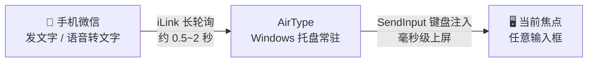
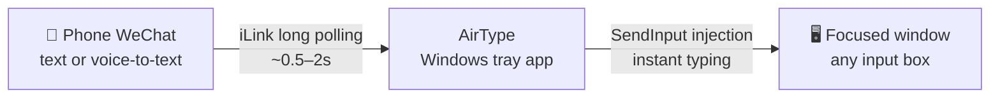

<a id="top"></a>

<div align="center">


# AirType

**对着手机说一句话，文字立刻出现在电脑上。**

微信发消息 → 电脑焦点窗口实时"打字"，配合手机语音转文字，就是一台隔空语音输入法。

[](https://github.com/TeemoSun/AirType/actions/workflows/ci.yml)
[](https://go.dev)
[](https://github.com/TeemoSun/AirType)
[](LICENSE)

**简体中文** · [English](#english)

</div>

---

## 它是怎么工作的



没有局域网配对、没有蓝牙、没有剪贴板同步——只要手机能上微信、电脑能联网，随时随地可用。

## ✨ 功能特性

- **零配置单文件 EXE**：Go 静态编译，无 DLL 依赖，绿色免安装，双击即用（无需管理员权限）
- **系统级打字**：Win32 `SendInput` 注入，中文、Emoji 直接上屏，不依赖输入法，任何能接收键盘的窗口都生效
- **微信 / QQ 双通道可选**：微信或 QQ 二选一（互斥、完全对等）。未绑定时弹出通道选择窗口，扫码即绑定；QQ 走官方机器人（WebSocket 实时推送 + 断线自动恢复会话），手机 QQ 发私聊同样隔空打字。换绑：托盘菜单"切换通道…"→ 回到选择窗口
- **常驻托盘**：四态图标一眼看清状态（绿=正常 / 灰=未绑定 / 黄=待扫码或异常 / 红=凭据失效），无需控制台窗口
- **历史弹窗**：OneDrive / Fluent 风格圆角弹窗，左键托盘即出；单击复制（行内"已复制"反馈）、右键复制 / 删除 / 重新打字、悬停看全文、键盘 ↑↓/Enter/Delete、迷你滚动条、失焦或 ✕ 关闭
- **彩色 emoji**：消息行 DirectWrite 渲染，😀🚀 与手机端同观感
- **深色模式**：自动跟随系统深浅色（含弹窗、窗口标题栏）
- **暂停打字 / 自动回车**：只记录不注入、打完自动补回车发送；都是托盘菜单开关，重启后记住状态
- **凭据加密存储**：微信 token 与 QQ 凭据经 Windows DPAPI 加密落盘（绑定到当前用户），明文文件自动迁移
- **免扫码重连**：token 本地持久化，重启电脑后自动恢复登录
- **开机自启**：托盘菜单一键注册计划任务
- **健康看门狗**：连接异常或长时间收不到消息自动转黄提醒

## 🚀 快速开始

1. **获取程序**
   - 从 [Releases](https://github.com/TeemoSun/AirType/releases) 下载 `AirType.exe`，或[从源码构建](#build-cn)
2. **运行并选择通道**：双击运行（无需管理员权限），首次启动自动弹出**通道选择窗口**，选择微信或 QQ
3. **扫码绑定**：按所选通道用手机微信 / QQ 扫描弹出的二维码确认
4. **开始隔空打字**：托盘图标变 🟢 绿色即连接成功。把电脑焦点切到任意输入框，用手机给 Bot 发一条消息——文字立刻上屏
5. **语音输入**：在手机上用微信自带的语音转文字，对着手机说话即可

数据（token、历史、日志）保存在 `%LOCALAPPDATA%\AirType\`，`-datadir` 可自定义目录。

## 🖥️ 托盘状态与操作

| 图标 | 状态 | 含义 |
| :---: | :--- | :--- |
| 🟢 | 已连接 | 一切正常，收发即注入 |
| ⚪ | 未绑定 | 未选择通道 / 首次启动，左键托盘弹出选择窗口 |
| 🟡 | 需要注意 | 待扫码、已暂停、连接异常、断开重连中 |
| 🔴 | 登录失效 | 凭据过期或被平台侧移除，需重新扫码绑定 |

- **左键托盘**：未绑定时弹通道选择窗口；待扫码时弹二维码；已绑定时弹出历史消息弹窗（再点一次收起）
- **历史弹窗**：单击条目复制（行内反馈），右键可复制 / 删除 / 重新打字，点窗口外或 ✕ 关闭，键盘 ↑↓ 导航
- **右键菜单**：查看历史 / 暂停打字 / 自动回车 ‖ 切换通道… ‖ 打开日志 / 清空历史 ‖ 开关机自启 ‖ 退出（绑定/换绑统一走通道选择窗口，菜单不含绑定项）

## ⚠️ 注意事项

- **换行即回车**：消息中的换行以回车键注入。在"Enter 即发送"的输入框（如微信 PC 版聊天框）里，多行文本会被逐行发送出去
- **自动回车即发送**：开启"自动回车"后，每条消息注入完都会补一次回车——在聊天应用里等于消息直接发出去，注意别把焦点留在会误发的窗口
- **只收不发**：AirType 不会以你的身份回复或发送任何消息，仅被动接收；QQ 通道只处理绑定者本人发来的私聊
- **管理员窗口**：AirType 本身无需管理员权限；但普通权限下无法向**已提权**的窗口（如任务管理器、管理员 PowerShell）注入输入，遇到会明确提示

<a id="build-cn"></a>

## 🛠️ 从源码构建

统一入口 `scripts/build.sh`（Git Bash）：

```bash
scripts/build.sh all      # tidy + vet + test + 全部二进制 → build/
scripts/build.sh icons    # 重新生成图标资源（cmd/icongen）
scripts/build.sh uishot   # 拉起真实 UI 截图到 %TEMP%（改 UI 后自检）
```

- **注入链路自测**（无人值守）：先启动 `build/typetest-target.exe`（测试靶子窗口），再运行
  `build/selftest.exe -window "AirType Typetest Target" -text "hello 世界 😀"`，比对 `typetest-result.txt`
- **UI 冒烟测试**：`build/traytest.exe` 模拟扫码→连接→弹窗→复制→图标守护的完整流程
- **QQ 网关联调**：`build/qqtest.exe -appid <id> -secret <s>` 直连 QQ 网关打印 READY/消息事件（网关协议本身有 httptest 单测覆盖）
- **资源文件**（图标 / manifest）由 [go-winres](https://github.com/tc-hib/go-winres) 生成；仓库提交的是开发版 `.syso`，Release 构建时 CI 会按 tag 重算 PE 版本号

## 🔧 技术要点

| 模块 | 实现 |
| :--- | :--- |
| 消息通道 | 微信：iLink 协议（`ilinkai.weixin.qq.com`）长轮询，端到端约 0.5~2 秒；QQ：官方机器人平台 WebSocket 推送（实测体感更快），空闲超时续期 + RESUME 会话恢复 + 退避复位，断线窗口消息不丢 |
| 键盘注入 | `SendInput` + `KEYEVENTF_UNICODE`，UTF-16 代理对完整支持 Emoji，换行折叠为回车 |
| 界面 | `lxn/walk` 原生 Win32 控件 + 自绘列表，Win11 DWM 圆角无边框弹窗；消息行 DirectWrite 渲染（彩色 emoji）；深浅色主题自动跟随 |
| 稳定性 | 单实例互斥锁、注入分批提交、看门狗健康检测、退出 2 秒兜底超时、托盘图标守护（任务栏重建/二次启动自动重挂）、微信/QQ 断线自动重连 |
| 安全 | 凭据 DPAPI 加密落盘、QQ 消息按绑定者 openid 过滤、错误气泡不泄漏内部信息 |
| 构建 | `CGO_ENABLED=0` 静态编译单文件，`.syso` 资源直接进 Git，CI 自动校验（vet/test/gofmt/tidy） |

完整设计文档见 [docs/开发方案.md](docs/开发方案.md)。

## 🗺️ 里程碑

- [x] **v1.0** 控制台 MVP：扫码绑定、实时注入、token 持久化
- [x] **v1.1** 托盘常驻：多态图标、扫码 GUI 化、暂停打字、自动回车、开机自启、QQ 通道
- [x] **历史弹窗**：Fluent 圆角弹窗、复制 / 删除 / 重新打字、键盘导航、深色模式、彩色 emoji
- [ ] **下一版本**：QQ 网关断线治理（空闲超时 + RESUME）、DPAPI 凭据加密、UI 全面重构、CI/版本工程化（本批已合入 main）
- [x] **v1.2** QQ 通道：微信/QQ 完全对等二选一、通道选择窗口、扫码绑定 QQ 官方机器人（WebSocket）；自动回车、托盘图标守护、网络抖动优化

## ⚠️ 免责声明

本项目是微信 iLink 协议与 QQ 扫码绑定协议的**独立逆向实现**，非微信/QQ 官方工具，与腾讯无关联。仅供个人学习与效率工具用途；属于未授权客户端形态，使用产生的账号风险自负，请遵守《微信软件许可及服务协议》与 QQ 相关服务协议。下载的 EXE 首次运行可能被 Windows SmartScreen 拦截（无代码签名证书），点"仍要运行"即可；校验和见 Release 附件。

## 📄 License

[MIT](LICENSE) © TeemoSun

---

<div align="center">

**感谢使用 AirType** · 如果它帮到了你，欢迎给个 ⭐ Star

</div>

---

<a id="english"></a>

<div align="center">

# AirType

**Say it to your phone — the words appear on your PC.**

Send a WeChat message from your phone and it's instantly "typed" into whatever
window is focused on your computer. Combined with your phone's voice-to-text,
it becomes a hands-free dictation input method for your PC.

[简体中文](#top) · **English**

</div>

---

## How It Works



No LAN pairing, no Bluetooth, no clipboard syncing — as long as your phone has
WeChat and your PC has internet, it works from anywhere.

## ✨ Features

- **Single-file EXE, zero setup** — statically compiled with Go, no DLL dependencies, portable, no admin rights needed
- **System-level typing** — Win32 `SendInput` injection: CJK and emoji typed directly,
  independent of any IME; works in any window that accepts keyboard input
- **Dual channel: WeChat or QQ** — one at a time, fully equal. A channel
  chooser appears when nothing is bound; scan the QR to bind. QQ goes through
  the official bot platform (WebSocket push with idle-timeout keepalive and
  session RESUME); messages sent to the bot on mobile QQ get typed the same
  way. To switch: "切换通道…" from the tray menu returns you to the chooser
- **Tray-resident** — four-state icon at a glance (green = OK, gray = unbound,
  yellow = needs attention, red = credentials expired), no console window
- **History popup** — Fluent-style rounded popup from a tray click: copy on click
  (inline "copied" feedback), right-click for copy / delete / retype, full text
  on hover, keyboard navigation, mini scrollbar, closes on focus loss or ✕
- **Color emoji** — message rows rendered with DirectWrite, 😀🚀 look like they do on your phone
- **Dark mode** — follows the system light/dark theme automatically
- **Pause typing / Auto-Enter** — record-only mode and send-after-typing; both are
  tray-menu toggles remembered across restarts
- **Encrypted credentials** — WeChat token and QQ secrets are sealed with Windows
  DPAPI (bound to your user account); legacy plaintext files migrate automatically
- **Persistent login** — token is stored locally; reconnects automatically after reboot
- **Autostart** — register a scheduled task from the tray menu
- **Health watchdog** — turns yellow on connection issues or long message silence

## 🚀 Quick Start

1. **Get the app** — download `AirType.exe` from
   [Releases](https://github.com/TeemoSun/AirType/releases), or [build from source](#build-en)
2. **Run & choose a channel** — launch the EXE (no admin rights needed); the
   channel chooser opens on first launch — pick WeChat or QQ
3. **Scan to pair** — scan the QR code with WeChat / QQ on your phone
4. **Start typing** — once the tray icon turns 🟢 green, focus any input box on your PC
   and send the bot a message from your phone — the text appears instantly
5. **Go voice** — use WeChat's voice-to-text on the phone for full dictation

Data (token, history, logs) lives in `%LOCALAPPDATA%\AirType\`; override with `-datadir`.

## 🖥️ Tray States & Controls

| Icon | State | Meaning |
| :---: | :--- | :--- |
| 🟢 | Connected | All good — messages are typed as they arrive |
| ⚪ | Unbound | No channel selected; left-click opens the chooser |
| 🟡 | Attention | Awaiting QR scan, paused, connection issues, or reconnecting |
| 🔴 | Expired | Credentials invalid; re-bind by scanning again |

- **Left-click the tray**: chooser when unbound; QR window while pairing;
  otherwise toggles the history popup
- **History popup**: click an entry to copy (inline feedback), right-click for
  copy / delete / retype, closes on focus loss or ✕, ↑↓/Enter/Delete keys work
- **Right-click menu**: history / pause / auto-enter ‖ switch channel… ‖ open log /
  clear history ‖ autostart ‖ exit (binding & switching go through the channel chooser, not the menu)

## ⚠️ Notes

- **Newlines become Enter presses** — in send-on-Enter inputs (e.g. WeChat desktop
  chats), a multi-line message will be sent line by line
- **Auto-Enter means auto-send** — with Auto-Enter enabled, every message gets a
  final Enter press: in chat apps that sends it. Keep your focus out of windows
  you don't want to post into
- **Receive-only** — AirType never replies or sends messages on your behalf;
  the QQ channel only processes direct messages from the account that bound it
- **Elevated windows** — no admin rights are needed for AirType itself, but an
  unelevated AirType cannot type into elevated windows (Task Manager, admin
  PowerShell); you'll get a clear notice when that happens

<a id="build-en"></a>

## 🛠️ Build from Source

One entrypoint, `scripts/build.sh` (Git Bash):

```bash
scripts/build.sh all      # tidy + vet + test + all binaries → build/
scripts/build.sh icons    # regenerate icon assets (cmd/icongen)
scripts/build.sh uishot   # screenshot the real UI to %TEMP% for visual checks
```

- **Unattended injection self-test**: start `build/typetest-target.exe` (a target
  window), then run `build/selftest.exe -window "AirType Typetest Target" -text "hello 😀"`
  and check `typetest-result.txt`
- **UI smoke test**: `build/traytest.exe` simulates scan → connect → popup → copy → tray-icon guard
- **QQ gateway check**: `build/qqtest.exe -appid <id> -secret <s>` connects directly and prints READY / message events (the gateway protocol itself is covered by httptest unit tests)
- **Resources** (icons / manifest) are generated by
  [go-winres](https://github.com/tc-hib/go-winres); the committed `.syso` is a dev
  version — Release builds regenerate PE version info from the tag in CI

## 🔧 Technical Highlights

| Area | Approach |
| :--- | :--- |
| Message channel | WeChat: iLink protocol (`ilinkai.weixin.qq.com`) long polling, ~0.5–2s end-to-end; QQ: official bot platform WebSocket push (noticeably faster in practice) with idle-timeout keepalive, session RESUME and backoff reset — no messages lost across reconnects |
| Keyboard injection | `SendInput` + `KEYEVENTF_UNICODE` with full UTF-16 surrogate-pair emoji support, newline→Enter folding |
| UI | `lxn/walk` native Win32 controls + custom-drawn list, Win11 DWM rounded borderless popup; DirectWrite text rows (color emoji); automatic light/dark theming |
| Robustness | single-instance mutex, batched input submission, health watchdog, 2s shutdown timeout, tray-icon guard (auto re-add on taskbar restart / second launch), auto-reconnect for both channels |
| Security | DPAPI-sealed credentials on disk, QQ messages filtered by the binding user's openid, error balloons never leak internals |
| Build | `CGO_ENABLED=0` static single binary, `.syso` resources committed, CI on every push (vet/test/gofmt/tidy), PE version injected from the release tag |

Full design docs (in Chinese): [docs/开发方案.md](docs/开发方案.md).

## 🗺️ Milestones

- [x] **v1.0** console MVP — QR pairing, live injection, persistent token
- [x] **v1.1** tray-resident — multi-state icon, GUI QR scan, pause, auto-enter,
  autostart, QQ channel with channel chooser
- [x] **history popup** — Fluent rounded popup, copy/delete/retype, keyboard
  navigation, dark mode, color emoji
- [ ] **next release** — QQ gateway disconnect hardening (idle timeout + RESUME),
  DPAPI credential sealing, full UI overhaul, CI/versioning engineering (merged to main)

## ⚠️ Disclaimer

This project is an **independent reverse-engineered implementation** of the WeChat
iLink protocol and the QQ QR-binding protocol. It is not an official WeChat or QQ
tool and is not affiliated with Tencent. For personal learning and productivity
use only. It is an unauthorized-client setup: any risk to your accounts is your
own, and you must comply with the WeChat Terms of Service and the corresponding
QQ service terms. Windows SmartScreen may flag the unsigned EXE on first run —
choose "Run anyway"; checksums are attached to every release.

## 📄 License

[MIT](LICENSE) © TeemoSun

---

<div align="center">

**Thanks for trying AirType** · A ⭐ star is always appreciated

</div>
