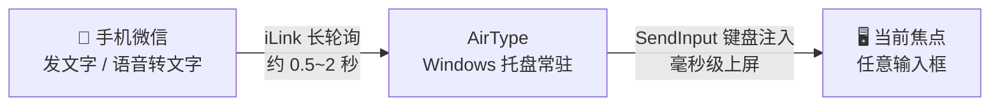
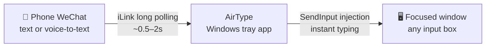

<a id="top"></a>

<div align="center">


# AirType

**对着手机说一句话，文字立刻出现在电脑上。**

微信发消息 → 电脑焦点窗口实时"打字"，配合手机语音转文字，就是一台隔空语音输入法。

[](https://github.com/TeemoSun/AirType/actions/workflows/ci.yml)
[](https://go.dev)
[](https://github.com/TeemoSun/AirType)
[](LICENSE)

**简体中文** · [English](#english)

</div>

---

## 它是怎么工作的



没有局域网配对、没有蓝牙、没有剪贴板同步——只要手机能上微信、电脑能联网，随时随地可用。

## ✨ 功能特性

- **零配置单文件 EXE**：Go 静态编译，无 DLL 依赖，绿色免安装，双击即用
- **系统级打字**：Win32 `SendInput` 注入，中文、Emoji 直接上屏，不依赖输入法，任何能接收键盘的窗口都生效
- **双通道：微信 + QQ**：除微信外，右键菜单"绑定 QQ 机器人"扫码即可接入 QQ 官方机器人（WebSocket 实时推送），手机 QQ 发私聊同样隔空打字
- **常驻托盘**：三态图标一眼看清状态，无需控制台窗口
- **历史弹窗**：OneDrive / Fluent 风格圆角弹窗，左键托盘即出，单击复制、右键删除、失焦自动关闭
- **暂停注入**：只记录不注入，消息不丢，随时恢复
- **自动回车**：消息打完自动补一次回车，在聊天窗口里直接发送出去（托盘菜单开关，重启后记住状态）
- **免扫码重连**：token 本地持久化，重启电脑后自动恢复登录
- **开机自启**：托盘菜单一键注册计划任务
- **健康看门狗**：连接异常或长时间收不到消息自动转黄提醒

## 🚀 快速开始

1. **获取程序**
   - 从 [Releases](https://github.com/TeemoSun/AirType/releases) 下载 `AirType.exe`，或[从源码构建](#build-cn)
2. **运行并授权**：双击运行，UAC 弹窗选择"是"（注入键盘输入需要管理员权限，被拒绝则不运行）
3. **扫码绑定**：首次启动托盘图标为 🔴 红色，左键托盘弹出二维码，用手机微信扫码确认
4. **开始隔空打字**：图标变 🟢 绿色即连接成功。把电脑焦点切到任意输入框，用手机微信给 Bot 发一条消息——文字立刻上屏
5. **语音输入**：在手机上用微信自带的语音转文字，对着手机说话即可

数据（token、历史、日志）保存在 `%LOCALAPPDATA%\AirType\`，`-datadir` 可自定义目录。

## 🖥️ 托盘状态与操作

| 图标 | 状态 | 含义 |
| :---: | :--- | :--- |
| 🟢 | 已连接 | 一切正常，收发即注入 |
| 🟡 | 异常 | 连接异常，或超过 10 分钟未收到消息 |
| 🔴 | 未登录 | 需要扫码（或已退出登录） |

- **左键托盘**：红色时弹扫码窗；否则弹出历史消息弹窗
- **历史弹窗**：单击条目复制到剪贴板，右键可复制 / 删除，点窗口外自动关闭
- **右键菜单**：暂停注入 / 自动回车 / 重新扫码 / 绑定 QQ 机器人 / 退出登录 / 清空历史 / 打开日志 / 开机自启 / 退出

## ⚠️ 注意事项

- **换行即回车**：消息中的换行以回车键注入。在"Enter 即发送"的输入框（如微信 PC 版聊天框）里，多行文本会被逐行发送出去
- **自动回车即发送**：开启"自动回车"后，每条消息注入完都会补一次回车——在聊天应用里等于消息直接发出去，注意别把焦点留在会误发的窗口
- **只收不发**：AirType 不会以你的身份回复或发送任何消息，仅被动接收
- **需要管理员权限**：这是向任意（含高权限）窗口注入输入的系统要求

<a id="build-cn"></a>

## 🛠️ 从源码构建

```bash
go mod tidy
go test ./...                    # 单元测试
go build -o build/ ./cmd/...     # 全部二进制（含测试工具）
```

- **注入链路自测**（无人值守）：先启动 `build/typetest-target.exe`（测试靶子窗口），再运行
  `build/selftest.exe -window "AirType Typetest Target" -text "hello 世界 😀"`，比对 `typetest-result.txt`
- **UI 冒烟测试**：`build/traytest.exe` 模拟扫码→连接→弹窗→复制的完整流程
- **资源文件**（图标 / manifest）由 [go-winres](https://github.com/tc-hib/go-winres) 生成，修改 `winres/*.json` 后运行
  `go-winres make --arch amd64 --out cmd/<目录>/rsrc`

## 🔧 技术要点

| 模块 | 实现 |
| :--- | :--- |
| 消息通道 | 微信 iLink 协议（`ilinkai.weixin.qq.com`）长轮询，端到端约 0.5~2 秒 |
| 键盘注入 | `SendInput` + `KEYEVENTF_UNICODE`，UTF-16 代理对完整支持 Emoji，换行折叠为回车 |
| 界面 | `lxn/walk` 原生 Win32 控件 + 自绘列表，Win11 DWM 圆角无边框弹窗 |
| 稳定性 | 单实例互斥锁、注入分批提交、看门狗健康检测、退出 2 秒兜底超时、托盘图标守护（任务栏重建/二次启动自动重挂） |
| 构建 | `CGO_ENABLED=0` 静态编译单文件，`.syso` 资源直接进 Git，CI 全平台校验 |

完整设计文档见 [docs/开发方案.md](docs/开发方案.md)。

## 🗺️ 里程碑

- [x] **v1.0** 控制台 MVP：扫码绑定、实时注入、token 持久化
- [x] **v1.1** 托盘常驻：三态图标、扫码 GUI 化、暂停注入、开机自启
- [x] **v2.0** 历史弹窗：Fluent 圆角弹窗、复制 / 删除、退出登录、全新图标

## ⚠️ 免责声明

本项目是微信 iLink 协议的**独立客户端实现**，非微信官方工具，与腾讯无关联。仅供个人学习与效率工具用途；属于未授权客户端形态，使用产生的账号风险自负，请遵守《微信软件许可及服务协议》。

## 📄 License

[MIT](LICENSE) © TeemoSun

---

<div align="center">

**感谢使用 AirType** · 如果它帮到了你，欢迎给个 ⭐ Star

</div>

---

<a id="english"></a>

<div align="center">

# AirType

**Say it to your phone — the words appear on your PC.**

Send a WeChat message from your phone and it's instantly "typed" into whatever
window is focused on your computer. Combined with your phone's voice-to-text,
it becomes a hands-free dictation input method for your PC.

[简体中文](#top) · **English**

</div>

---

## How It Works



No LAN pairing, no Bluetooth, no clipboard syncing — as long as your phone has
WeChat and your PC has internet, it works from anywhere.

## ✨ Features

- **Single-file EXE, zero setup** — statically compiled with Go, no DLL dependencies, portable
- **System-level typing** — Win32 `SendInput` injection: CJK and emoji typed directly,
  independent of any IME; works in any window that accepts keyboard input
- **Dual channel: WeChat + QQ** — besides WeChat, scan a QR from the tray menu
  ("绑定 QQ 机器人") to connect an official QQ bot (WebSocket push); messages
  sent to the bot on mobile QQ get typed the same way
- **Tray-resident** — three-state icon tells you everything at a glance, no console window
- **History popup** — Fluent-style rounded popup from a tray click: copy on click,
  delete via right-click, auto-close on focus loss
- **Pause injection** — messages are recorded but not typed, nothing is lost
- **Auto-Enter** — after each message is typed, an extra Enter is pressed to send
  it right away in chat apps (tray-menu toggle, remembered across restarts)
- **Persistent login** — token is stored locally; reconnects automatically after reboot
- **Autostart** — register a scheduled task from the tray menu
- **Health watchdog** — turns yellow on connection issues or long message silence

## 🚀 Quick Start

1. **Get the app** — download `AirType.exe` from
   [Releases](https://github.com/TeemoSun/AirType/releases), or [build from source](#build-en)
2. **Run & elevate** — launch the EXE and accept the UAC prompt (admin rights are
   required to inject keyboard input; the app exits if declined)
3. **Scan to pair** — on first launch the tray icon is 🔴 red; click it to show the
   QR code and scan it with WeChat on your phone
4. **Start typing** — once the icon turns 🟢 green, focus any input box on your PC
   and send the bot a message from your phone — the text appears instantly
5. **Go voice** — use WeChat's voice-to-text on the phone for full dictation

Data (token, history, logs) lives in `%LOCALAPPDATA%\AirType\`; override with `-datadir`.

## 🖥️ Tray States & Controls

| Icon | State | Meaning |
| :---: | :--- | :--- |
| 🟢 | Connected | All good — messages are typed as they arrive |
| 🟡 | Warning | Connection issues, or no message for 10+ minutes |
| 🔴 | Logged out | Needs a QR scan (or logged out) |

- **Left-click the tray**: shows the QR window when red; otherwise toggles the history popup
- **History popup**: click an entry to copy it, right-click for copy / delete, closes on focus loss
- **Right-click menu**: pause / auto-enter / rescan QR / bind QQ bot / log out / clear history / open log / autostart / exit

## ⚠️ Notes

- **Newlines become Enter presses** — in send-on-Enter inputs (e.g. WeChat desktop
  chats), a multi-line message will be sent line by line
- **Auto-Enter means auto-send** — with Auto-Enter enabled, every message gets a
  final Enter press: in chat apps that sends it. Keep your focus out of windows
  you don't want to post into
- **Receive-only** — AirType never replies or sends messages on your behalf
- **Admin rights required** — a system requirement for injecting input into any window

<a id="build-en"></a>

## 🛠️ Build from Source

```bash
go mod tidy
go test ./...                    # unit tests
go build -o build/ ./cmd/...     # all binaries (incl. test tools)
```

- **Unattended injection self-test**: start `build/typetest-target.exe` (a target
  window), then run `build/selftest.exe -window "AirType Typetest Target" -text "hello 😀"`
  and check `typetest-result.txt`
- **UI smoke test**: `build/traytest.exe` simulates scan → connect → popup → copy
- **Resources** (icons / manifest) are generated by
  [go-winres](https://github.com/tc-hib/go-winres): after editing `winres/*.json`,
  run `go-winres make --arch amd64 --out cmd/<dir>/rsrc`

## 🔧 Technical Highlights

| Area | Approach |
| :--- | :--- |
| Message channel | WeChat iLink protocol (`ilinkai.weixin.qq.com`) long polling, ~0.5–2s end-to-end |
| Keyboard injection | `SendInput` + `KEYEVENTF_UNICODE` with full UTF-16 surrogate-pair emoji support, newline→Enter folding |
| UI | `lxn/walk` native Win32 controls + custom-drawn list, Win11 DWM rounded borderless popup |
| Robustness | single-instance mutex, batched input submission, health watchdog, 2s shutdown timeout, tray-icon guard (auto re-add on taskbar restart / second launch) |
| Build | `CGO_ENABLED=0` static single binary, `.syso` resources committed, CI on every push |

Full design docs (in Chinese): [docs/开发方案.md](docs/开发方案.md).

## 🗺️ Milestones

- [x] **v1.0** console MVP — QR pairing, live injection, persistent token
- [x] **v1.1** tray-resident — tri-state icon, GUI QR scan, pause, autostart
- [x] **v2.0** history popup — Fluent rounded popup, copy/delete, logout, new icon set

## ⚠️ Disclaimer

This project is an **independent client implementation** of the WeChat iLink
protocol. It is not an official WeChat tool and is not affiliated with Tencent.
For personal learning and productivity use only. It is an unauthorized-client
setup: any risk to your WeChat account is your own, and you must comply with
the WeChat Terms of Service.

## 📄 License

[MIT](LICENSE) © TeemoSun

---

<div align="center">

**Thanks for trying AirType** · A ⭐ star is always appreciated

</div>
