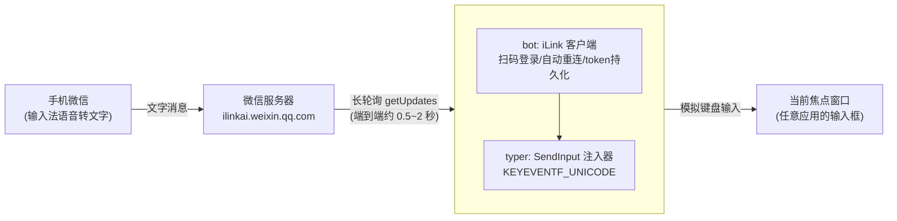

# AirType（隔空打字）开发方案

> 手机微信发一条文字消息，电脑在当前焦点输入框里立刻把这段字"打"出来。
> Windows 绿色单文件 EXE，Go 语言实现，双击即用。

## 1. 可行性结论

**结论：可行，技术链路已逐项核实（2026-09）。**

| 环节 | 结论 | 依据 |
|---|---|---|
| 微信消息通道 | ✅ 存在且合法 | 微信 ClawBot 插件（iLink 协议），接入域名 `ilinkai.weixin.qq.com`，微信开放社区有官方接口文档（二维码登录、消息收发） |
| Go 语言的协议 SDK | ✅ 存在 | [the-yex/wechat-ilink-sdk](https://github.com/the-yex/wechat-ilink-sdk)：扫码登录、长轮询收消息、自动重连、token 持久化，纯 Go、Apache-2.0、要求 Go 1.21+ |
| 只收不发是否成立 | ✅ 成立 | SDK 的发送限制（context_token、24 小时窗口）只约束"机器人向外发消息"；本项目只调用 `OnText` 接收，不发送，不受影响 |
| 键盘注入 | ✅ 成熟能力 | Win32 `SendInput` + `KEYEVENTF_UNICODE` 直接注入 Unicode 字符（中文无需经过输入法），只作用于当前前台窗口——与"手动切好焦点再发消息"的使用方式正好匹配 |
| 单文件绿色 EXE | ✅ 天然支持 | Go 静态编译 `CGO_ENABLED=0`，无 DLL 依赖 |

**主要不确定性（有对策）：**

- 该 SDK 目前是伪版本（无 tag，17 stars、0 引用），成熟度低 → 锁定版本 + 精读源码；SDK 所需能力面很窄（扫码 + 长轮询 + 文本回调），极端情况下可参考官方 npm 包 `@tencent-weixin/openclaw-weixin` 的源码自行实现协议，工作量约 1~2 周，不影响项目生死。
- 独立实现协议客户端属于"未授权客户端"灰色地带（详见 §8 合规声明），个人低频纯接收使用风险可控。

## 2. 总体架构



核心链路只有两段，没有自建服务器、没有第三方转发，消息走微信官方链路到本机，本机注入到焦点窗口。

## 3. 技术选型与关键决策

### 3.1 技术栈

| 项 | 选择 | 说明 |
|---|---|---|
| 语言 | Go 1.22+ | 静态编译单 EXE；开发机需先安装 Go（当前未装，`winget install GoLang.Go` 或官网 MSI） |
| iLink 协议 | `github.com/the-yex/wechat-ilink-sdk`（锁定伪版本） | 提供 `NewClient / OnText / Run`，`Run` 内部完成扫码登录与长轮询循环 |
| 键盘注入 | 自研薄封装：`golang.org/x/sys/windows` 调 `user32.dll!SendInput` | 不引入第三方注入库（`dacapoday/sendinput` 仅 2 stars 且 Unicode 支持未证实），核心代码约 100 行，可控可测 |
| 管理员权限 | 嵌入 app.manifest（`requireAdministrator`），用 go-winres 生成 `.syso` | UAC 被拒绝则直接退出（已确认的产品行为）；同时嵌入程序图标 |
| 二维码 | SDK 自带终端二维码显示 | 无需额外依赖；后续 GUI 化时可换成窗口/浏览器展示 |
| 日志 | slog → 控制台 + 本地文件 | 便于排查"没收到/没打出来"类问题 |

### 3.2 关键决策：token 存储路径（对此前讨论的修正）

核实 SDK 源码发现：**默认 token 路径是 `./.weixin/default.json`，相对当前工作目录**，而不是此前讨论以为的"用户家目录"。

风险：以管理员右键运行 EXE 时，工作目录是 `C:\Windows\System32`，token 会被写进系统目录；换一种启动方式又写到别处，导致反复扫码。

决策：代码中显式指定 TokenStore 到 **`%LOCALAPPDATA%\AirType\token.json`**（`os.UserConfigDir()` 拼接，文件权限 0600）。以管理员运行时 `%LOCALAPPDATA%` 指向管理员账户，效果上正是我们想要的"跟着管理员账户走"，且不依赖启动方式——用户无感，符合"不用配置"的初衷。

### 3.3 关键决策：注入方式

- 用 `KEYEVENTF_UNICODE`（非虚拟键码）：每个字符一次 key-down + key-up，中文、emoji、全角标点直接注入，不触发、不依赖目标机器输入法状态。
- 整段文本组装成一个 `INPUT` 数组，**一次 `SendInput` 调用批量注入**，原子性好，不会插进用户正在敲的字中间。
- 消息中的 `\n` 映射为一次 `VK_RETURN` 按键；其余控制字符过滤。
- 已知边界：极少数不处理 `WM_CHAR` 的程序（部分游戏、自绘控件）收不到注入字符，属已知限制，文档中说明即可。

### 3.4 模块结构

```
AirType/
├── main.go                 # 装配：日志 → token 存储 → bot 客户端 → typer
├── internal/
│   ├── bot/                # iLink 客户端封装：登录、OnText 过滤、重连、事件日志
│   ├── typer/              # SendInput 注入器：文本→INPUT[]、换行映射、批量注入
│   ├── store/              # token 存储：%LOCALAPPDATA%\AirType\token.json (0600)
│   └── tray/               # (v1.1) 托盘常驻、暂停/恢复
├── assets/                 # 图标、app.manifest
├── docs/开发方案.md
└── ...
```

## 4. 功能范围

### v1.0（MVP，本计划交付）

1. 双击运行 → UAC 提权（拒绝则退出）→ 终端显示二维码 → 手机微信扫码绑定
2. token 持久化，之后启动免扫码；会话过期自动恢复
3. 收到**文本**消息 → 500ms 内注入当前焦点窗口；图片/语音/文件等类型忽略
4. 断网、休眠恢复后自动重连继续接收
5. 日志落盘；`-h` 显示用法

### v1.1（体验增强，MVP 之后）

- 系统托盘常驻：暂停/恢复注入（防误触发）、退出、重新扫码
- 注入中视觉/声音提示（避免"字打到别处了"的困惑）
- 消息过滤规则：可选"仅注入以特定前缀开头的消息"
- 隐藏控制台窗口（`-H windowsgui` + 托盘）

### 明确不做

- 不做消息回复/发送（规避 context_token、频控等全部发送侧限制）
- 不做语音消息转写（手机输入法语音转文字已解决）
- 不做多账号

## 5. 开发计划

> 按业余时间估算，总计约 5~7 个工作日日晚间时段可到 v1.0。

### M0 环境准备（0.5 天）

- [ ] 安装 Go 1.22+、验证 `go version`
- [ ] `go mod init`，拉取 SDK，跑通官方 `examples/qrcode-login` 示例
- **验收**：终端出现二维码，手机扫码后打印登录成功

### M1 核心链路打通（1 天）——最高风险环节在此消化

- [ ] demo：`OnText` 收到消息 → `SendInput` 注入英文到记事本
- [ ] 注入中文验证（`KEYEVENTF_UNICODE` 路径）
- [ ] 实测端到端延迟（手机发送 → 电脑出字）
- **验收**：手机发 "hello 世界"，1 秒内记事本出现 "hello 世界"
- **风险出口**：若 SDK 不可用，此阶段即切自研协议（参考官方 npm 源码），计划顺延 1~2 周

### M2 产品化 MVP（2 天）

- [ ] `internal/typer`：批量注入、换行映射、控制字符过滤、错误处理
- [ ] `internal/store`：token 持久化到 `%LOCALAPPDATA%\AirType\`
- [ ] `internal/bot`：重连退避、SessionExpired 处理、消息去重（长轮询重连可能重推）
- [ ] 嵌入 manifest（requireAdministrator）与图标；UAC 拒绝即退出
- [ ] 日志文件；README 使用说明
- **验收**：非开发目录双击 EXE 全流程可用，重启免扫码，休眠唤醒后仍能收发注入

### M3 兼容性测试与加固（1~2 天）

- [ ] 手测矩阵：记事本 / Chrome 地址栏与网页输入框 / Word / VS Code / 微信 PC 版聊天框 / 以管理员运行的程序
- [ ] 长文本（500+ 字）、含 emoji、含换行、连续多条消息时序
- [ ] 异常场景：断网 30s、锁屏、休眠唤醒、token 过期、扫码后立即手机端解绑
- [ ] 修复问题，打 tag v1.0.0

### M4 发布（0.5 天）

- [ ] GitHub Actions：CI 构建 + Release 附上 `AirType.exe`（可复现构建）
- [ ] README 完善免责声明与常见问题

## 6. 风险与对策

| 风险 | 等级 | 对策 |
|---|---|---|
| SDK 无 tag、维护不明 | 高 | M1 即验证；锁定伪版本；必要时 fork 自维护；协议参考官方 npm 包，可自研兜底 |
| 腾讯调整/收紧接口 | 中 | 关注开放社区公告；纯接收用法依赖面小（一个 getUpdates + 登录接口） |
| UIPI：无法向更高权限窗口注入 | 低 | 本程序自身以管理员运行（manifest），天然覆盖 |
| 焦点在非输入框时误注入 | 中 | 使用方式约定（用户自己切焦点）；v1.1 提供暂停热键与注入提示 |
| 长轮询重连导致消息重复 | 低 | 按消息 ID 去重 |
| 账号风控（未授权客户端） | 中 | 纯被动接收、个人低频使用；README 明示风险，仅供个人学习用途 |
| 中文注入乱码 | 低 | 走 `KEYEVENTF_UNICODE` 而非虚拟键码/剪贴板，M1 优先验证 |

## 7. 测试方案

- **单元测试**：`typer` 文本→INPUT 转换（中文/emoji/换行/控制字符）；`store` 读写与权限
- **集成测试**（手动，按 M3 矩阵执行并记录结果到 docs）
- **延迟基线**：连续 20 条消息采样，记录 P50/P95 端到端延迟，写入 README

## 8. 合规声明（将同步写入 README）

本项目是 iLink 协议的**独立客户端实现**，非微信官方工具，与腾讯无关联。官方授权路径是"OpenClaw 宿主 + 官方插件"；本项目未破解任何技术保护，但属于未授权客户端形态，腾讯保留风险提示、拦截、封号的权利。仅供个人学习与效率工具用途，请遵守《微信软件许可及服务协议》，使用产生的账号风险自负。
