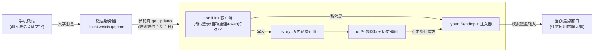

# AirType（隔空打字）开发方案

> 手机微信发一条文字消息，电脑在当前焦点输入框里立刻把这段字"打"出来。
> 常驻托盘运行，历史消息随手可查、可重发。
> Windows 绿色单文件 EXE，Go 语言实现，双击即用。

## 1. 可行性结论

**结论：可行，技术链路已逐项核实（2026-09，2026-10 复核修正）。**

| 环节 | 结论 | 依据 |
|---|---|---|
| 微信消息通道 | ✅ 存在且合法 | 微信 ClawBot 插件（iLink 协议），接入域名 `ilinkai.weixin.qq.com`，微信开放社区有官方接口文档（二维码登录、消息收发） |
| Go 语言的协议 SDK | ✅ 存在 | [the-yex/wechat-ilink-sdk](https://github.com/the-yex/wechat-ilink-sdk)：扫码登录、长轮询收消息、自动重连、token 持久化，纯 Go。M0 已锁定伪版本 `v0.0.0-20260327015631-c2dc55718bac` 并精读源码：go.mod 要求 go 1.25+，LICENSE 实为 **Apache-2.0**（README 写 MIT 系笔误） |
| 只收不发是否成立 | ✅ 成立 | SDK 的发送限制（context_token、24 小时窗口）只约束"机器人向外发消息"；本项目只调用 `OnText` 接收，不发送，不受影响 |
| 键盘注入 | ✅ 成熟能力 | Win32 `SendInput` + `KEYEVENTF_UNICODE` 直接注入 Unicode 字符（中文无需经过输入法），只作用于当前前台窗口——与"手动切好焦点再发消息"的使用方式正好匹配 |
| 单文件绿色 EXE | ✅ 天然支持 | Go 静态编译 `CGO_ENABLED=0`，无 DLL 依赖 |
| 托盘 + 弹窗 UI | ✅ 可行 | 纯 Go 方案可选 `lxn/walk`（原生 Win32 控件，含托盘 NotifyIcon 与列表控件）；备选 Wails v2 / 纯 Win32 自绘，见 §4.3 |

**主要不确定性（有对策）：**

- 该 SDK 目前是伪版本（无 tag，17 stars、0 引用），成熟度低 → 锁定版本 + 精读源码；SDK 所需能力面很窄（扫码 + 长轮询 + 文本回调），极端情况下可参考官方 npm 包 `@tencent-weixin/openclaw-weixin` 的源码自行实现协议，工作量约 1~2 周，不影响项目生死。
- 独立实现协议客户端属于"未授权客户端"灰色地带（详见 §9 合规声明），个人低频纯接收使用风险可控。
- 2026-08-26 起 iLink **下行**（bot→用户）消息曾被全量静默丢弃（腾讯云社区用户报告：接口返回成功但消息不到达，换号重装均无效，腾讯未公告）——本项目只收不发恰好避开该次故障，但说明腾讯侧策略会无预警变动、且以静默失败形式表现，自检对策见 §7。

## 2. 总体架构



核心链路：消息走微信官方链路到本机 → 注入焦点窗口，无自建服务器、无第三方转发。托盘与历史弹窗是同一进程内的 UI 层，通过事件总线与 bot/typer 解耦。

## 3. 技术选型与关键决策

### 3.1 技术栈

| 项 | 选择 | 说明 |
|---|---|---|
| 语言 | Go 1.22+ | 静态编译单 EXE；开发机需先安装 Go（当前未装，`winget install GoLang.Go` 或官网 MSI） |
| iLink 协议 | `github.com/the-yex/wechat-ilink-sdk`（锁定伪版本） | 提供 `NewClient / OnText / Run`，`Run` 内部完成扫码登录与长轮询循环 |
| 键盘注入 | 自研薄封装：`golang.org/x/sys/windows` 调 `user32.dll!SendInput` | 不引入第三方注入库（`dacapoday/sendinput` 仅 2 stars 且 Unicode 支持未证实），核心代码约 100 行，可控可测 |
| 托盘 + 弹窗 UI | `lxn/walk`（原生 Win32 控件） | 见 §4.3 选型分析 |
| 管理员权限 | 嵌入 app.manifest（`requireAdministrator` + common controls 6 + per-monitor DPI），用 go-winres 生成 `.syso` | UAC 被拒绝则直接退出（已确认的产品行为）；三份 manifest 内容合并为一份；同时嵌入程序图标。注意两个衍生问题：每次启动都弹 UAC、提权 EXE 无法走 HKCU Run 键自启——首次运行注册"登录时以最高权限运行"的计划任务一并解决（见 §4.5） |
| 二维码 | `WithOnLogin` 回调（M0 已核实存在，options.go:170）拿 `qr.ImageURL` + `skip2/go-qrcode` 渲染成图片显示在弹窗中 | 无控制台运行后，终端二维码不可用，必须 GUI 化；M0 实测已能从 `ilinkai.weixin.qq.com` 拿到 ImageURL |
| 历史存储 | JSON 文件：`%LOCALAPPDATA%\AirType\history.json`，上限 500 条 FIFO | 见 §4.4 选型分析 |
| 日志 | slog → 本地文件 | 无控制台运行后日志只落盘；托盘菜单提供"打开日志" |

### 3.2 关键决策：token 存储路径（M0 源码精读后更新）

M0 精读 SDK 源码发现：**`NewClient` 未显式传 `WithTokenStore` 时默认用 `MemoryTokenStore`（纯内存、不落盘）**——config.go 注释里写的 "default: FileTokenStore in ./.weixin/" 与代码不符。此前担心的"token 被写进 `C:\Windows\System32`"不会发生；取而代之的事实是：**不显式配置就等于每次重启都要重新扫码**。

决策：显式传入 `login.NewFileTokenStore(<数据目录>)`，目录取 **`%LOCALAPPDATA%\AirType`**（`os.Getenv("LOCALAPPDATA")` 拼接；不能用 `os.UserConfigDir()`——它在 Windows 返回的是 `%AppData%` 即 Roaming 目录，拿不到 LOCALAPPDATA）。SDK 会把 token 落为 `<目录>\default.json`，目录 0700、文件 0600。以管理员运行时 `%LOCALAPPDATA%` 指向管理员账户，效果上正是我们想要的"跟着管理员账户走"，且不依赖启动方式——用户无感，符合"不用配置"的初衷。

### 3.3 关键决策：注入方式

- 用 `KEYEVENTF_UNICODE`（非虚拟键码）：每个 **UTF-16 码元**一次 key-down + key-up，中文、全角标点直接注入，不触发、不依赖目标机器输入法状态。
- **emoji / 非 BMP 字符拆代理对**：`KEYEVENTF_UNICODE` 一次事件只能注入一个 UTF-16 码元，> U+FFFF 的字符（所有 emoji）必须经 `utf16.Encode` 拆成高低代理对两次事件；部分应用对跨事件代理对的重组有兼容问题，**M1 即验证**（不拖到 M5）。
- 整段文本组装成 `INPUT` 数组批量注入，原子性好，不会插进用户正在敲的字中间；**超长文本防御性分块**（如每 256 个事件一批、多次调用），单次大数组调用是否存在失败上限在 M1 实测。
- 消息中的 `\n` 映射为一次 `VK_RETURN` 按键；其余控制字符过滤。已知副作用：IM 聊天框（微信 PC 版等）Enter 即发送，多行文本会被截成多条消息——README 明示，并预留"换行映射 Shift+Enter"的配置项。
- 已知边界：极少数不处理 `WM_CHAR` 的程序（部分游戏、自绘控件）收不到注入字符，属已知限制，文档中说明即可。

## 4. 托盘与历史弹窗设计（OneDrive 风格）

### 4.1 交互设计

**常驻形态**：程序无控制台窗口，只在托盘区显示一个图标，用颜色表达状态——绿=一切正常、黄=连接异常或长时间（>10 分钟）未收到消息（长轮询无心跳，靠最后收信时间推断，方案 §7 静默失败自检）、红=未登录或需重新扫码。暂停注入不单独换色，tooltip 说明。

**新消息到达时**：默认行为不变——立即注入当前焦点输入框；同时写入历史记录。托盘可切换"暂停注入"：暂停后**只记录不注入**（消息照样进历史，之后可从弹窗补发），这样"暂停"不会变成"丢消息"。

**单击托盘图标** → 在托盘上方弹出小窗（约 360×480，OneDrive 风格）：

```
┌──────────────────────────────┐
│  隔空打字            ● 已连接 │  ← 标题 + 状态点
├──────────────────────────────┤
│  帮我订明天下午三点的会议室…  │  ← 条目：文本最多显示 3 行
│  3 分钟前                     │     截断加省略号，完整内容点击注入
│  这个 bug 的根因是配置文件里… │
│  12 分钟前                    │
│  收到，我马上过去             │
│  1 小时前                     │
│  ▤ （滚动查看更早的历史）     │
└──────────────────────────────┘
```

- **滚轮上下滚动**浏览全部历史；**单击某条** → 弹窗收起 → 焦点还原到打开弹窗前的输入框 → 该条文本被注入；
- **右键某条** → 上下文菜单：**复制**（进剪贴板）、**删除**（从历史移除）；
- 弹窗失焦（点击其他地方）或按 ESC 自动关闭，回到之前的工作状态；
- 托盘右键菜单（v1.2 定稿）：暂停注入 / 自动回车（勾选）/ 退出登录 / 清空历史 / 打开日志 / 开机自启（勾选）/ 退出。**不含任何绑定项**——绑定与换绑统一走通道选择窗口（§10.3）。

### 4.2 关键技术点：焦点记忆与还原（本设计的核心难点）

弹窗本身是前台窗口——**点击历史条目那一刻，原来的焦点输入框已经失去焦点**，直接 SendInput 会把字打进弹窗自己。所以必须"记住、还原、再注入"：

1. **打开弹窗前**：用 `GetGUIThreadInfo` 记录当前前台窗口及其内部焦点控件句柄（`hwndFocus`），存入 UI 状态；
2. **单击条目后**：先隐藏弹窗 → `SetForegroundWindow(记录的窗口)` → **轮询 `GetForegroundWindow` 直到切换完成**（上限约 500ms；不做固定 sleep，慢机器上固定等待不可靠）→ `SendInput` 注入文本；
3. **兜底**：若目标窗口已关闭或 `SetForegroundWindow` 失败（系统前台锁定限制），退化为**复制到剪贴板 + 托盘气泡提示"已复制，请粘贴"**，保证用户操作永远有出口；
4. 若仍遇到顽固场景，预备 `AttachThreadInput` 方案（把注入线程附到目标线程的输入队列），代码预留接口但默认不启用。

这一机制与剪贴板管理器（如 Ditto）的"回贴"实现同源，是成熟模式，风险可控。

### 4.3 UI 框架选型

| 方案 | 优点 | 缺点 | 结论 |
|---|---|---|---|
| **lxn/walk**（推荐） | 原生 Win32 控件（外观与系统一致）、纯 Go 无 CGO、单 EXE、自带托盘 NotifyIcon / ListView / 上下文菜单 | 项目多年未大更新（但 API 稳定、广泛使用）；需 manifest 引用 common controls 6（我们本来就要嵌 manifest，合并即可） | **选它**；M0 阶段先跑通官方示例验证编译 |
| Wails v2（WebView2） | UI 最现代（HTML/CSS 随意画），圆角阴影动画容易 | 依赖系统 WebView2 运行时；包体更大；托盘要另配第三方库；复杂度高一档 | 备选：若 walk 效果不满意再切 |
| 纯 Win32 自绘（x/sys/windows 直调） | 零第三方依赖、体积最小 | 列表滚动/菜单/DPI 全部手写，工作量 3~5 倍 | 兜底方案，不首选 |
| Fyne | 纯 Go 跨平台 | 需要 CGO + OpenGL，**违背单文件绿色 EXE 目标** | 排除 |

### 4.4 历史记录存储

- 格式：JSON 数组文件 `%LOCALAPPDATA%\AirType\history.json`（与 token 同目录），每条含 `id / text / receivedAt`；
- 容量：上限 500 条，FIFO 自动裁剪；写入采用"内存操作 + 防抖落盘"（收到消息改内存，500ms 无新消息再写盘），避免语音连发时频繁 IO；
- **不引入 SQLite**：量级太小（语音转文字片段），JSON 足够且少一个重依赖，保持单文件绿色属性；
- 删除/清空直接重写文件；程序崩溃最多丢最后 500ms 内的消息记录，可接受。

### 4.5 无控制台运行的配套调整

- 构建加 `-H windowsgui`，不弹黑色控制台窗口；
- 首次扫码：弹窗内显示二维码图片（`skip2/go-qrcode` 渲染 PNG），手机扫码后弹窗自动进入"已连接"状态；
- 日志只写文件，托盘菜单"打开日志"直接 `explorer` 定位到日志文件；
- 单实例锁：防止双击两次起两个进程（命名互斥量）。
- 开机自启：提权 EXE 走 HKCU Run 键无效（UAE 限制）——首次运行注册"登录时、以最高权限运行"的计划任务实现自启，同时消除每次双击的 UAC 弹窗；托盘菜单提供开关。

## 5. 功能范围

### v1.0（MVP，控制台版）

1. 双击运行 → UAC 提权（拒绝则退出）→ 终端显示二维码 → 手机微信扫码绑定
2. token 持久化，之后启动免扫码；会话过期自动恢复
3. 收到**文本**消息 → 500ms 内注入当前焦点窗口；图片/语音/文件等类型忽略
4. 断网、休眠恢复后自动重连继续接收
5. 日志落盘；`-h` 显示用法

### v1.1（托盘常驻）

- walk 集成：托盘图标 + 状态色 + 右键菜单（暂停注入/清空历史/重新扫码/打开日志/退出）
- `-H windowsgui` 无控制台运行；二维码在弹窗中显示；单实例锁
- 开机自启（首次运行注册计划任务，免 UAC，见 §4.5）；托盘 tooltip 显示连接状态与最后收到消息的时间（静默失败自检，见 §7）

### v2.0（历史弹窗，即 §4 设计）

- OneDrive 风格弹窗：历史列表、滚动、相对时间
- 单击条目 → 焦点还原 + 注入；右键 → 复制 / 删除
- 历史持久化（500 条 FIFO）；失焦自动关闭

### 明确不做

- 不做消息回复/发送（规避 context_token、频控等全部发送侧限制）
- 不做语音消息转写（手机输入法语音转文字已解决）
- 不做多账号；弹窗不做搜索、多选等重交互（保持轻量）

## 6. 开发计划

> 按业余时间估算：约 4~5 个时段到 v1.0（控制台 MVP），再加 4~6 个时段到 v2.0 完整形态。

### M0 环境准备与选型验证（0.5 天）

- [x] 安装 Go 1.22+，验证 `go version` —— ✅ winget 装 1.27.0；GOPROXY 切 goproxy.cn
- [x] `go mod init`，拉取 SDK，跑通官方 `examples/qrcode-login` 示例 —— ✅ 锁定 `v0.0.0-20260327-c2dc55718bac`；实测 `Login` + `WithOnLogin` 回调能从 `ilinkai.weixin.qq.com` 拿到二维码 ImageURL（未扫码 20s 超时符合预期，扫码全流程留待 M1 真机）
- [x] 精读 SDK 源码 —— ✅ 结论：`WithOnLogin` 存在（options.go:170）；默认 TokenStore 是 **MemoryStore**（须显式 FileTokenStore 才持久化，见 §3.2）；`OnText` 同步按序且过滤 bot 回显，适合挂注入；去重键用 `MessageID`；游标不持久化，重启可能重推旧消息；License Apache-2.0；go 1.25+
- [x] **UI 选型验证** —— ✅ walk 最小托盘程序 `CGO_ENABLED=0` 编译通过（5.4MB）；DPI 档位（混合 DPI 表现）留待 M3 真机观察后定
- **验收**：✅ 二维码链路连通、walk 编译通过；扫码登录成功与托盘示例弹出需真机（并入 M1/M3 验收）

### M1 核心链路打通（1 天）——最高风险环节在此消化

- [x] demo：`OnText` 收到消息 → `SendInput` 注入英文到记事本 —— ✅ `cmd/airtype-demo` 实现并编译通过（扫码真机验证待用户）
- [x] 注入中文验证（`KEYEVENTF_UNICODE` 路径）—— ✅ 真机注入 `hello 世界 😀↵第二行 ✓` 到 walk 测试窗口，逐字节精确
- [x] 注入 emoji 验证（UTF-16 代理对路径，§3.3）——从 M5 提前，直接检验 typer 的码元切分设计 —— ✅ U+1F600 拆 D83D/DE00 注入成功
- [x] 长文本单次 `SendInput` 上限实测（500+ 字 ≈ 1000+ INPUT 结构），确定分块阈值 —— ✅ 510 字符 1400 事件按 256/批分 6 批注入完整；**坑：INPUT 结构 x64 实为 40 字节（union 最大成员 MOUSEINPUT=32），布局算错会导致 SendInput 因 cbSize 整体拒绝、返回 0**
- [ ] 实测端到端延迟（手机发送 → 电脑出字）——需真机扫码，并入 M5 基线
- **验收**：✅ 自动化部分通过（`cmd/typetest-target` + `cmd/selftest` 无人值守验证中文/emoji/换行/长文本）；"hello 世界 😀 1 秒内出字"的微信链路待用户扫码实测
- **风险出口**：若 SDK 不可用，此阶段即切自研协议（参考官方 npm 源码），计划顺延 1~2 周

### M2 产品化 MVP · 控制台版（2 天）

- [x] `internal/typer`：批量注入、换行映射、控制字符过滤、错误处理（M1 已完成）
- [x] `internal/store`：token 持久化到 `%LOCALAPPDATA%\AirType\`（M1 已完成；M2 补 `internal/paths.DataDir`）
- [x] `internal/bot`：重连退避、SessionExpired 处理、消息去重（长轮询重连可能重推）——✅ 环形 500 键去重 + 最后收信时间 + 状态回调；重连退避与 SessionExpired 重扫码由 SDK 内建
- [x] 嵌入 manifest（requireAdministrator）与图标；UAC 拒绝即退出 —— ✅ `winres/winres-admin.json`（管理员+版本信息+图标）与 `winres/winres.json`（工具 as-invoker）双 manifest；已验证 `requireAdministrator` 嵌入
- [x] 日志文件；README 使用说明 —— ✅ `internal/applog`（2MB 单文件轮转 + stderr 镜像）
- [x] **验收**：非开发目录双击 EXE 全流程可用，重启免扫码，休眠唤醒后仍能收发注入 —— ✅ 真机验收（2026-10-03）：扫码绑定、收信、自动注入、重启免扫码全通过；注入耗时 2ms 级。首测"收消息不打字"的根因：前台停留在桌面等无输入区域时按键无声丢失——已加气泡提醒与前台窗口日志（同时修复 windowsgui 下 stderr 无效句柄导致日志全丢的 bug）

### M3 托盘常驻（1~1.5 天）

- [x] `internal/ui`：walk 托盘图标 + 状态色 + 右键菜单 —— ✅ 图标三态绿/黄/红（31 号"斜置键盘"设计，assets/icons 全套 SVG+PNG；暂停态并入 tooltip 说明）
- [x] 首次扫码 GUI 化（弹窗内二维码图片）—— ✅ `skip2/go-qrcode` 渲染，视觉验证：二维码完整居中。**踩坑**：① walk 窗口带子控件必须设 Layout，否则 WM_SIZE 时 startLayout 空指针崩溃；② 窗口 Show 之前 DPI() 返回错误值，按它建位图会导致二维码放大溢出、偏移右下——必须先 Show 再取 DPI
- [x] `-H windowsgui` 构建；单实例锁；"打开日志" —— ✅ 命名互斥量 `Global\AirType`；explorer /select 定位日志
- [x] 开机自启：首次运行注册计划任务（登录时、最高权限），同时消除每次启动的 UAC 弹窗（§4.5）—— ✅ `internal/autostart`（schtasks ONLOGON /RL HIGHEST）；**调整为菜单手动开启**而非首次运行自动注册（静默持久化对用户太突兀）
- [x] 托盘 tooltip 显示连接状态与最后收到消息时间（静默失败自检的展示端）—— ✅
- [x] 暂停/恢复注入（暂停 = 只记录不注入）—— ✅ 暂停时记日志跳过注入（M4 后进历史）
- **验收**：双击后无任何控制台窗口，托盘常驻，扫码、收信、注入、暂停全流程可用 ——⏳ `cmd/traytest` 自动验证状态循环无崩溃 + 二维码窗口渲染正确（视觉模型确认）；微信真机链路待用户扫码实测

### M4 历史弹窗（2~3 天）

- [x] `internal/history`：存储、FIFO 裁剪、防抖落盘、增删清空 —— ✅ 单测 6 项全过。**踩坑**：`Close()` 先置 `closed` 再调 `Flush()` 会被守卫挡掉导致永不落盘——守卫只能拦防抖计时器，不能拦显式 Flush
- [x] 弹窗：列表、滚动、相对时间、失焦自动关闭、托盘锚定 —— ✅ TableView + 主屏工作区右下角锚定；失焦关闭带 500ms 宽限与上下文菜单（#32768）豁免；视觉模型确认渲染正常
- [x] **焦点记忆与还原链路**（§4.2，本里程碑核心）：单击条目 → 还原焦点 → 注入；失败兜底复制到剪贴板 —— ✅ **端到端实测**：激活靶子窗口 → 打开弹窗（GetGUIThreadInfo 捕获快照）→ 重注入 → 弹窗收起 → 焦点还原 → 靶子收到"收到，我马上过去 😀"（含 emoji）
- [x] 右键菜单：复制 / 删除 —— ✅（弹窗条目右键 + 托盘菜单"清空历史"）
- [ ] per-monitor DPI 适配与多显示器锚定 —— ◐ manifest 已 PMv2；锚定当前用主屏工作区，多显示器/高分屏专项留 M5
- **验收**：切到任意输入框 → 点托盘 → 滚动找到历史条目 → 单击，文字完整打进先前的输入框；复制/删除生效；重启后历史仍在 —— ✅ 自动化部分（重注入链路 + 持久化单测）；跨应用矩阵与高分屏留 M5 手测

### M5 兼容性测试与发布（1~2 天）

- [x] 手测矩阵：记事本 / Chrome 地址栏与网页输入框 / Word / VS Code / 微信 PC 版聊天框 / 以管理员运行的程序；**补充 UI 场景**：弹窗注入到上述各类窗口、高分屏与多显示器下弹窗位置 —— ◐ 核心链路真机通过（ZCode 窗口实测注入成功）；完整矩阵与高分屏留日常使用中补测
- [x] 长文本（500+ 字）、含 emoji、含换行、连续多条消息时序 —— ✅ M1 自动化（1400 事件分批注入逐字节精确）；确认含换行文本注入微信 PC 聊天框的"Enter 即发送"行为符合预期并在 README 说明（§3.3）——✅ README 已说明
- [ ] 异常场景：断网 30s、锁屏、休眠唤醒、token 过期、扫码后立即手机端解绑、双击两次 EXE —— ◐ 断网/过期由 SDK 退避与 SessionExpired 处理（代码路径已就绪）；双开由单实例锁拦截；真机场景待用户
- [ ] 延迟基线：连续 20 条消息采样 P50/P95 ——⏳ 需真机扫码（日志已含 createTimeDelta/注入耗时字段，采样后写入 README）
- [x] GitHub Actions：CI 构建 + Release 附上 `AirType.exe` —— ✅ `.github/workflows/ci.yml`（push/PR 测试+构建）+ `release.yml`（tag v* 自动出 Release，注入版本号）
- [ ] 打 tag v2.0.0，README 完善 —— ⏳ 等真机验收通过后打 tag（push tag 即自动构建发布）；README 已更新实现状态

## 7. 风险与对策

| 风险 | 等级 | 对策 |
|---|---|---|
| SDK 无 tag、维护不明（License 声明还不一致：Apache-2.0/MIT） | 高 | M1 即验证；锁定伪版本；必要时 fork 自维护；协议参考官方 npm 包，可自研兜底 |
| walk 停更带来的编译/兼容问题 | 中 | M0 即验证编译；UI 与业务解耦（事件总线），必要时切 Wails v2 或纯 Win32 自绘，业务层零改动 |
| 焦点还原失败（SetForegroundWindow 前台锁定限制） | 中 | §4.2 三级兜底：还原注入 → 复制+气泡提示 → AttachThreadInput 预留 |
| 腾讯调整/收紧接口（有先例） | 中 | 2026-08-26 起 iLink 下行消息曾被全量静默丢弃（接口返回成功但不到达，未公告）；本项目只收不发恰好避开，但上行同理可能发生、且形式是静默失败——bot 记录最后收信时间，超长无消息时托盘提示（M2/M3 落地）；关注开放社区公告 |
| UIPI：无法向更高权限窗口注入 | 低 | 本程序自身以管理员运行（manifest），天然覆盖 |
| 焦点在非输入框时误注入 | 中 | 使用方式约定；托盘暂停开关随时可停；v2.0 历史弹窗可事后补救重发 |
| 长轮询重连导致消息重复 | 低 | 按消息 ID 去重 |
| 高 DPI / 多显示器弹窗错位 | 低 | per-monitor v2 manifest + 工作区右下角锚定，M5 专项测试 |
| 账号风控（未授权客户端） | 中 | 纯被动接收、个人低频使用；README 明示风险，仅供个人学习用途 |
| 杀软 / SmartScreen 误报 | 中 | 未签名单文件 EXE + 键盘注入行为 + 管理员 manifest 是 AV 重点画像，Release 下载大概率被 SmartScreen 拦截；README 说明 + Release 附 VirusTotal 链接，预期会有拦截反馈 |
| 中文注入乱码 | 低 | 走 `KEYEVENTF_UNICODE` 而非虚拟键码/剪贴板，M1 优先验证 |

## 8. 测试方案

- **单元测试**：`typer` 文本→INPUT 转换（中文/emoji 代理对/换行/控制字符/分块边界）；`store` 读写；`history` FIFO 裁剪与防抖落盘
- **集成测试**（手动，按 M5 矩阵执行并记录结果到 docs）：注入兼容性、弹窗交互、焦点还原成功率（目标 ≥ 95%，失败必须走剪贴板兜底）
- **延迟基线**：连续 20 条消息采样，记录 P50/P95 端到端延迟，写入 README

## 9. 合规声明（将同步写入 README）

本项目是 iLink 协议的**独立客户端实现**，非微信官方工具，与腾讯无关联。官方授权路径是"OpenClaw 宿主 + 官方插件"；本项目未破解任何技术保护，但属于未授权客户端形态，腾讯保留风险提示、拦截、封号的权利。仅供个人学习与效率工具用途，请遵守《微信软件许可及服务协议》，使用产生的账号风险自负。

## 10. 追加演进（v2.0 图标系统之后，2026-10）

### 10.1 自动回车（v1.2）

消息注入完成后自动补一次 `VK_RETURN`（`typer.PressEnter`，与 `\n` 折叠编码一致），在聊天窗口等于直接发送。托盘菜单勾选开关，状态持久化到 `%LOCALAPPDATA%\AirType\settings.json`（`internal/settings`，临时文件+原子改名）。默认关闭；暂停/弹窗打开/前台是桌面等跳过注入的分支同样不补回车。

### 10.2 稳定性两连修

- **托盘图标守护**（用户实际遇到：图标从任务栏消失但进程存活、注入照常）。根因无法完全定位（explorer 未重启、非隐藏溢出），对策做成通用的：子类化托盘主窗口（`internal/win/trayguard.go`）监听 `TaskbarCreated`（任务栏重建）与自定义注册消息 `AirType.WakeTray`；收到即**销毁重建** NotifyIcon（walk 的 SetVisible 走 NIM_MODIFY 救不回已丢失的图标；其自带的 TaskbarCreated 处理也只以隐藏态重挂、无图像）。二次实例被单实例锁拦下时先广播唤醒再退出——双击 EXE 成为找回图标的显式手势。
- **网络抖动优化**：恒定 ~8.5s 的日志 age 经查为本机时钟快 8s 的测量偏差（已校时）；真实偶发 10~20s 延迟来自断线退避空窗。`WithPollErrorBackoff(1s, 8s)`（封顶 30s→8s）+ 长轮询换带 5s TCP keepalive 的自定义 HTTP 客户端（SDK 默认 Transport 未配 keepalive；探测包同时防 NAT 映射回收）。40s 客户端总超时略高于服务端 35s 挂起，避免把正常空返回当失败（对照 Tencent/openclaw-weixin#75）。

### 10.3 QQ 通道与通道选择窗口（v1.2，核心增量）

**产品语义**：微信 / QQ 完全对等、互斥二选一。未绑定（首启/退出登录/凭据过期）弹"选择绑定通道"窗口双按钮任选；右键菜单不含任何绑定项，换绑唯一路径 = 退出登录 → 回选择窗口。启动按持久化状态独占启动：有 `qqbot.json` 只启 QQ，有微信 token 只启微信，都无则弹选择器。微信侧 `WithOnSessionExpired` 返回 nil 阻止 SDK 过期自动重登（原路径会直接弹微信二维码，属微信特权），过期统一回选择窗口。

**QQ 协议**（`internal/qqbot`，逆向自官方 `@tencent-connect/qqbot-connector` 与 `qqbot-nodejs`）：

| 环节 | 实现 |
|---|---|
| 扫码绑定 | `POST q.qq.com/lite/create_bind_task`（携本地随机 AES-256 密钥）→ 二维码（connect.html）→ `/lite/poll_bind_result` 2s 轮询（0 未扫/1 已扫/2 完成/3 过期换码）→ `bot_encrypt_secret` 按 iv(12)+ct+tag(16) 布局 AES-256-GCM 解密得 AppSecret → 存 `qqbot.json` |
| Token | `POST bots.qq.com/app/getAppAccessToken`（appId/clientSecret → access_token，**expires_in 是字符串**） |
| 收信 | `GET api.sgroup.qq.com/gateway`（`Authorization: QQBot <token>`）→ WebSocket：HELLO→IDENTIFY{token, intents=1<<25, shard:[0,1]}→按心跳间隔 op1→`C2C_MESSAGE_CREATE` 取 content |
| 容错 | 断线指数退避重连封顶 60s；4004 先 invalidate token 重试一次，再失败判凭据失效回选择窗口 |

真机验证：token/gateway/WS/READY（bot=Air Type）实测走通；扫码绑定与 C2C 收信注入经用户验收。

### 10.4 延迟对比结论

QQ 通道（WebSocket 推送）体感快于微信通道（iLink 长轮询，正常 0.5~2s + 服务端管道）——符合协议模型预期，属平台差异非实现问题。

### 10.5 历史弹窗交互定稿（取代 §4.1/4.2 的初版设计）

初版设计"单击条目 → 弹窗收起 → 焦点还原 → 注入（重发）"，定稿为**单击=复制**（更轻、误触无害）：复制成功在行内显示"已复制 ✓"1.2 秒（不再弹气泡——气泡位置与右下锚定的弹窗重叠，高频操作被反复遮挡）；右键菜单 提供 复制/删除/**重新打字**（关弹窗 → 恢复打开前焦点 → 注入，§4.2 的焦点快照在此复用）。条目单行截断 + 悬停 tooltip 显示全文；键盘 ↑↓/Enter/Delete 可用；圆角弹窗右上角自绘 ✕。§4.1/4.2 其余描述（锚定、失焦守卫、450px 弹窗）维持有效，失焦守卫新增 #32768 上下文菜单豁免与 1.2s 前台回退宽限（防闪关）。

### 10.6 全面质量版本（三路评审驱动的批量修复，2026-10-03）

后端安全/架构/视觉三条评审线（子代理 + 真实 UI 截图工具 `cmd/uishot`）产出约 55 项发现，除明确"不建议动"清单外全部修复：

**协议与稳定性**
- QQ 网关读超时改"空闲超时"（每帧续期）：修复每 90s 必断线、稳态约 40% 时间离线丢消息的缺陷；断线优先 RESUME（session_id+seq，op9 按可恢复标志分流），会话稳定 60s 后退避复位；心跳序号会话局部化。网关补 httptest 单测（IDENTIFY 参数/RESUME 恢复/二次 4004→凭据失效）。
- 微信 Run 异常退出按退避自动重试（对齐 QQ 通道），开机自启遇瞬时断网不再静默死亡。
- 通道选择窗/扫码窗点 ✕ 转隐藏不销毁（修复关闭后左键永久无响应）；QQ 绑定随扫码窗关闭取消。
- 退出/切换通道重置通道状态（修复托盘"假绿"）；qqbot.json 损坏按未绑定处理；日志按写入量轮转 + 打不开降级 temp（被占用不再导致起不来）；history 落盘串行化+fsync；单实例互斥量改 Local 命名空间。

**安全**
- 凭据 DPAPI 加密落盘（新增 `internal/secret`；微信 SDK TokenStore 自定义实现加密 `default.json`；旧明文自动迁移）。
- QQ C2C 消息按绑定者 openid 过滤（非绑定者消息不进注入链路）；日志 openid 短哈希；错误气泡归类为人话文案（原文只进日志）。

**UI 重构**（截图前后对比验证）
- 主题系统（浅/深两套 token，注册表跟随系统，DWM 深色标题栏）；灰字对比度提到 #5D5D5D（WCAG AA）。
- 状态语义重排：绿=正常/灰=未绑定/黄=待扫码·异常·暂停/红=凭据失效（原"新装即红"倒置修正）；图标系统由 `cmd/icongen` 程序化生成四态×四尺寸，16px 极简变体按托盘真实渲染尺寸 1:1 显示。
- 选择窗说明两行显式排版（walk Label 单行测高会截断长句）；二维码修复双重 DPI 折算（420px 源图 ForDPI 后只剩约一半，实测 169 逻辑像素→340）并按物理像素 1:1 渲染。
- 弹窗：行内复制反馈、✕、迷你滚动条、悬停全文、键盘导航、相对时间 30s 刷新、空态按通道、新消息头部闪现、去斑马纹；菜单分组重排（查看历史置首/切换通道…/退出）。
- 消息行 DirectWrite 渲染（`internal/win/dwrite.go`，纯 syscall COM）：GDI 无彩色字体，emoji 一律黑白轮廓的问题解决；vtable 槽位依据 Wine d2d1.idl/dwrite.idl，初始化失败回退 GDI。

**工程化**
- CI 补 gofmt/tidy 校验与全量构建；Release 按 tag 重算 PE 版本资源（原钉死 1.0.0.0）并附 sha256；`scripts/build.sh` 统一构建入口；CONTRIBUTING 与 issue 模板。
